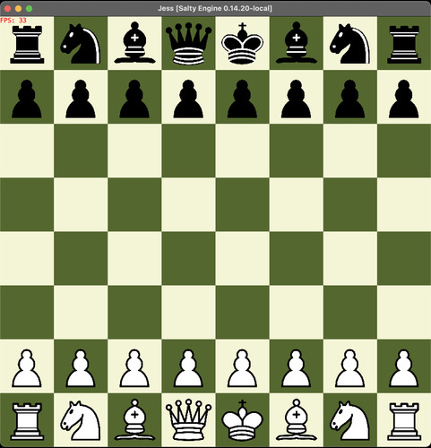

# Jess


Jess is a free, open source chess sandbox, meaning you get a **standard chess board
without any rules nor mechanics**. Any move can be done at any time, no matter the
color or legality of the move. This makes it perfect to just **try out some positions**
without having to move the opposing colors every second move.

## Technology
Jess is built using java, and a library called [Salty Engine](https://www.github.com/sanj0/salty-engine).

Salty Engine is also free and open source and maintained by myself, downloading
and installing it using maven is thus needed to build and use Jess.

## How to install Jess
To use Jess you can either download an existing release from github or build 
Jess yourself using git, maven and java.

1. download and install Salty Engine using git, maven and java
    1. clone the repository
        ```bash
        git clone https://www.github.com/sanj0/salty-engine
        ```
    2. install the engine
        ```bash
        cd salty-engine && mvn clean install
        ```
2. download and install Jess using git, maven and java
    1. clone the repository
        ```bash
        git clone https://www.github.com/sanj0/jess
        ```
    2. build Jess and copy the runnable jar       
        ```bash
        cd jess
        mvn clean install
        JESS_EXECUTABLE_JAR=$(ls target | sort | grep ^jess | head -1)
        cp target/${JESS_EXECUTABLE_JAR} bin/jess.jar
        ```
The executable Jess jar is now at `bin/jess.jar` and can be executed like any 
regular jar using for example
```bash
java -jar bin/jess.jar
```

## How to use Jess


